Visualization
================

install.packages(“ggridges”)

install.packages(c(‘crul’, ‘XML’, ‘gridExtra’, ‘isdparser’, ‘geonames’,
‘hoardr’)) install.packages(“~/Downloads/rnoaa_1.4.0.tar.gz”, repos =
NULL, type = “source”)

``` r
library(tidyverse)
```

    ## ── Attaching core tidyverse packages ──────────────────────── tidyverse 2.0.0 ──
    ## ✔ dplyr     1.1.4     ✔ readr     2.1.5
    ## ✔ forcats   1.0.0     ✔ stringr   1.5.1
    ## ✔ ggplot2   3.5.1     ✔ tibble    3.2.1
    ## ✔ lubridate 1.9.3     ✔ tidyr     1.3.1
    ## ✔ purrr     1.0.2     
    ## ── Conflicts ────────────────────────────────────────── tidyverse_conflicts() ──
    ## ✖ dplyr::filter() masks stats::filter()
    ## ✖ dplyr::lag()    masks stats::lag()
    ## ℹ Use the conflicted package (<http://conflicted.r-lib.org/>) to force all conflicts to become errors

``` r
library(ggridges)
```

## Load the weather data

``` r
weather_df = 
  rnoaa::meteo_pull_monitors(
    c("USW00094728", "USW00022534", "USS0023B17S"),
    var = c("PRCP", "TMIN", "TMAX"), 
    date_min = "2021-01-01",
    date_max = "2022-12-31") %>% 
  mutate(
    name = recode(
      id, 
      USW00094728 = "CentralPark_NY", 
      USW00022534 = "Molokai_HI",
      USS0023B17S = "Waterhole_WA"),
    tmin = tmin / 10,
    tmax = tmax / 10)  %>% 
  select(name, id, everything())
```

    ## using cached file: /Users/yu/Library/Caches/org.R-project.R/R/rnoaa/noaa_ghcnd/USW00094728.dly

    ## date created (size, mb): 2024-05-18 14:02:16.709216 (8.605)

    ## file min/max dates: 1869-01-01 / 2024-05-31

    ## using cached file: /Users/yu/Library/Caches/org.R-project.R/R/rnoaa/noaa_ghcnd/USW00022534.dly

    ## date created (size, mb): 2024-05-18 14:02:38.87762 (3.896)

    ## file min/max dates: 1949-10-01 / 2024-05-31

    ## using cached file: /Users/yu/Library/Caches/org.R-project.R/R/rnoaa/noaa_ghcnd/USS0023B17S.dly

    ## date created (size, mb): 2024-05-18 14:02:43.732044 (1.022)

    ## file min/max dates: 1999-09-01 / 2024-05-31

-metep_pull_monitors: pull data from open resources

## Scatterplots

Create my first scatterplot ever

``` r
ggplot(weather_df, aes(x = tmin, y = tmax)) + 
  geom_point()
```

    ## Warning: Removed 17 rows containing missing values or values outside the scale range
    ## (`geom_point()`).

<!-- -->

-aes: stands for “aesthetics” and is used to specify the mapping of
variables in your data to visual properties (aesthetics) of the plot.
This includes properties like x and y coordinates, colors, shapes,
sizes, etc.

-geom_point():adds a geometric layer to your plot. In this case,
geom_point creates a scatter plot .

New approach, same plot.

``` r
weather_df %>%
  ggplot(aes(x = tmin, y = tmax)) +
  geom_point()
```

    ## Warning: Removed 17 rows containing missing values or values outside the scale range
    ## (`geom_point()`).

<!-- -->

Save and edit a plot object.

``` r
weather_plot = 
  weather_df %>% 
  ggplot(aes(x = tmin, y = tmax))

weather_plot + geom_point()
```

    ## Warning: Removed 17 rows containing missing values or values outside the scale range
    ## (`geom_point()`).

<!-- -->

## Advanced scatterplot

Start with the same one and make it fancy!

``` r
weather_df %>%
  ggplot(aes(x = tmin, y = tmax, color = name)) +
  geom_point() +
  geom_smooth(se = FALSE)
```

    ## `geom_smooth()` using method = 'loess' and formula = 'y ~ x'

    ## Warning: Removed 17 rows containing non-finite outside the scale range
    ## (`stat_smooth()`).

    ## Warning: Removed 17 rows containing missing values or values outside the scale range
    ## (`geom_point()`).

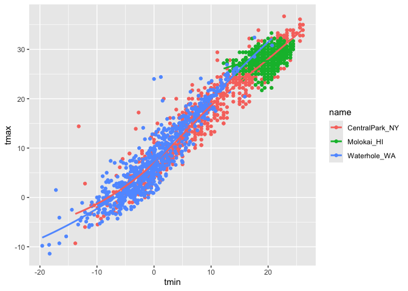<!-- -->

-color points according the name. -geom_smooth(se = FALSE): add smooth
curve. -se = FALSE: Disables the display of the confidence interval. By
default, geom_smooth shows a 95% confidence interval around the smooth
curve.

What about the aes placement ?

``` r
weather_df %>%
  ggplot(aes(x = tmin, y = tmax)) +
  geom_point(aes(color = name)) +
  geom_smooth()
```

    ## `geom_smooth()` using method = 'gam' and formula = 'y ~ s(x, bs = "cs")'

    ## Warning: Removed 17 rows containing non-finite outside the scale range
    ## (`stat_smooth()`).

    ## Warning: Removed 17 rows containing missing values or values outside the scale range
    ## (`geom_point()`).

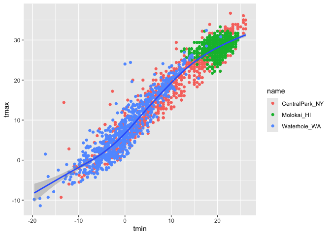<!-- -->

- color only applied to the points and not include geom_smooth.

Let’s facet some things!

``` r
weather_df %>%
  ggplot(aes(x = tmin, y = tmax, color = name)) +
  geom_point(alpha = .2, size = .3) +
  geom_smooth(se = FALSE) +
  facet_grid(. ~ name)
```

    ## `geom_smooth()` using method = 'loess' and formula = 'y ~ x'

    ## Warning: Removed 17 rows containing non-finite outside the scale range
    ## (`stat_smooth()`).

    ## Warning: Removed 17 rows containing missing values or values outside the scale range
    ## (`geom_point()`).

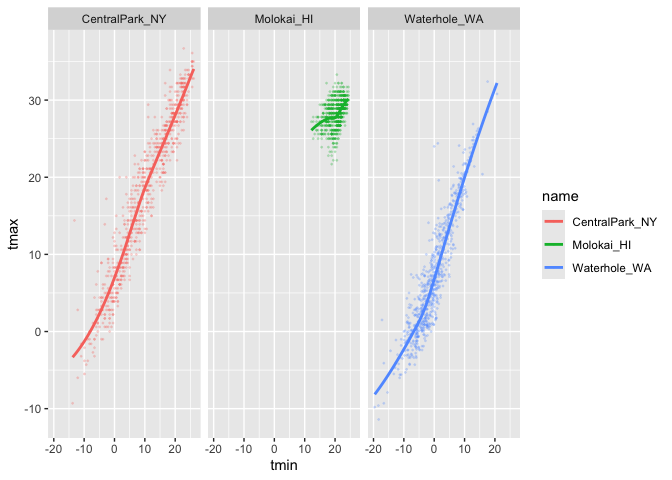<!-- -->

-ggplot(aes(x = tmin, alpha = tmin, y = tmax, color = name)): points
transparency will change based on tmin -geom_point(alpha = .2, size =
.3): make points 20% transparency, size to .3 -facet_grid(. ~ name):
don’t create rows, but create columns that describe names: three panel
plots -facet_grid(name ~ .): create rows (three panel plots according to
names), but not columns

Let’s combine some elements and try a new plot.

``` r
weather_df %>% 
  ggplot(aes(x = date, y = tmax, color = name)) +
  geom_point(aes(size = prcp), alpha = .5) +
  geom_smooth(se = FALSE) +
  facet_grid(. ~ name)
```

    ## `geom_smooth()` using method = 'loess' and formula = 'y ~ x'

    ## Warning: Removed 17 rows containing non-finite outside the scale range
    ## (`stat_smooth()`).

    ## Warning: Removed 19 rows containing missing values or values outside the scale range
    ## (`geom_point()`).

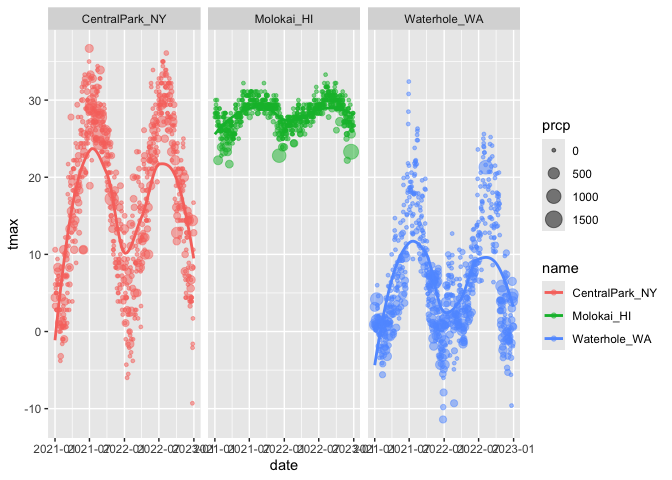<!-- -->
-aes(size = prcp): point size shows the prcp(precipitation).

## Some small notes

How many geoms have to exist?

You can have whatever geoms you want.

``` r
weather_df %>% 
  ggplot(aes(x = tmin, y = tmax, color = name)) +
  geom_smooth(se = FALSE)
```

    ## `geom_smooth()` using method = 'loess' and formula = 'y ~ x'

    ## Warning: Removed 17 rows containing non-finite outside the scale range
    ## (`stat_smooth()`).

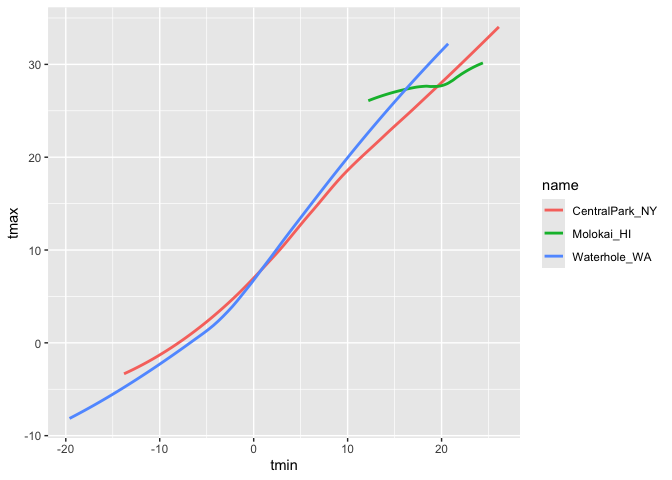<!-- -->

You can use a neat geom!

``` r
weather_df %>% 
  ggplot(aes(x = tmin, y = tmax)) +
  geom_hex()
```

    ## Warning: Removed 17 rows containing non-finite outside the scale range
    ## (`stat_binhex()`).

<!-- -->

-geom_hex: give us 2D plot(hexagrams). When sample size is large, this
helps is to understand the distribution of the data.

``` r
weather_df %>% 
  ggplot(aes(x = tmin, y = tmax)) +
  geom_bin2d()
```

    ## Warning: Removed 17 rows containing non-finite outside the scale range
    ## (`stat_bin2d()`).

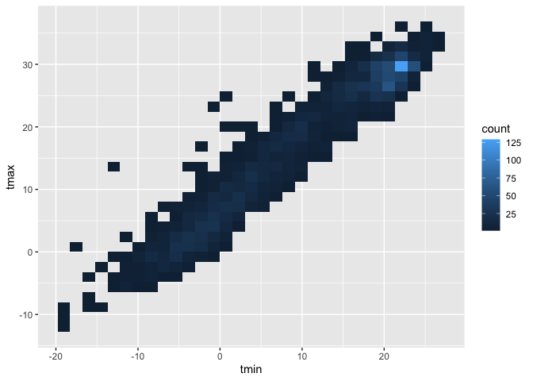<!-- -->

-geom_bin2d: You can also use geom_bin2d, which is in square.

``` r
weather_df %>% 
  ggplot(aes(x = tmin, y = tmax)) +
  geom_density2d() +
  geom_point(alpha = .3)
```

    ## Warning: Removed 17 rows containing non-finite outside the scale range
    ## (`stat_density2d()`).

    ## Warning: Removed 17 rows containing missing values or values outside the scale range
    ## (`geom_point()`).

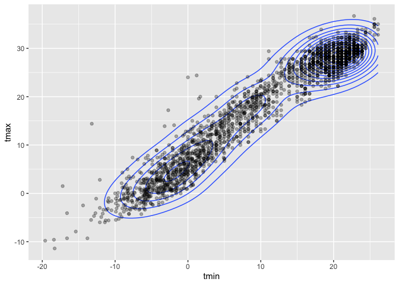<!-- -->

geom_density2d: like a contour plot

## Univariate plots

Histograms are really great.

``` r
weather_df %>% 
  ggplot(aes(x = tmin)) +
  geom_histogram()
```

    ## `stat_bin()` using `bins = 30`. Pick better value with `binwidth`.

    ## Warning: Removed 17 rows containing non-finite outside the scale range
    ## (`stat_bin()`).

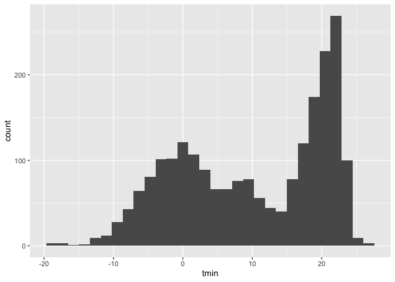<!-- -->

Can we add color

``` r
weather_df %>% 
  ggplot(aes(x = tmin, fill = name)) +
  geom_histogram(position = "dodge")
```

    ## `stat_bin()` using `bins = 30`. Pick better value with `binwidth`.

    ## Warning: Removed 17 rows containing non-finite outside the scale range
    ## (`stat_bin()`).

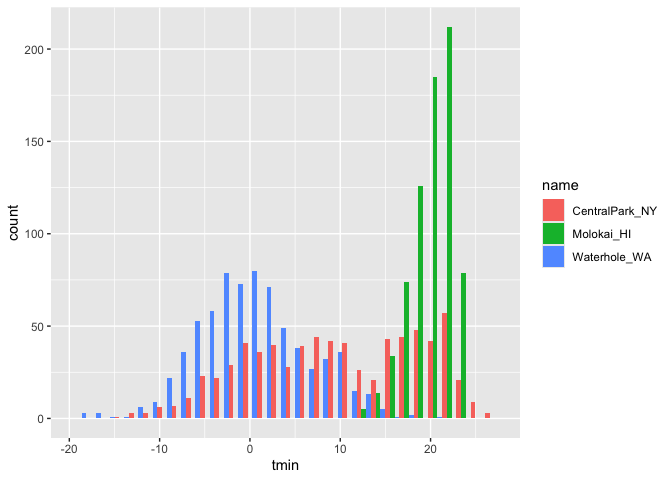<!-- -->

-position = “dodge”:it separates the bars for different groups so that
they do not overlap but are placed next to each other. -fill = name:
fill the color in the bar (color = name just color the outside of the
bar)

``` r
weather_df %>% 
  ggplot(aes(x = tmin, fill = name)) +
  geom_histogram() +
  facet_grid(. ~ name)
```

    ## `stat_bin()` using `bins = 30`. Pick better value with `binwidth`.

    ## Warning: Removed 17 rows containing non-finite outside the scale range
    ## (`stat_bin()`).

<!-- -->

-facet_grid(. ~ name): create three panel plots separately

Let’s try a new geometry!

``` r
weather_df %>% 
  ggplot(aes(x = tmin, fill = name)) +
  geom_density(alpha = .3, adjust = .5)
```

    ## Warning: Removed 17 rows containing non-finite outside the scale range
    ## (`stat_density()`).

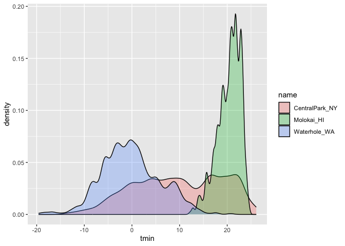<!-- -->

geom_density: density curve adjust = .5: adjusts the bandwidth of the
density estimate.Give you more information about the change of the
trend(more bumps).

What about box plots?

``` r
weather_df %>% 
  ggplot(aes(x = name, y = tmin)) +
  geom_boxplot()
```

    ## Warning: Removed 17 rows containing non-finite outside the scale range
    ## (`stat_boxplot()`).

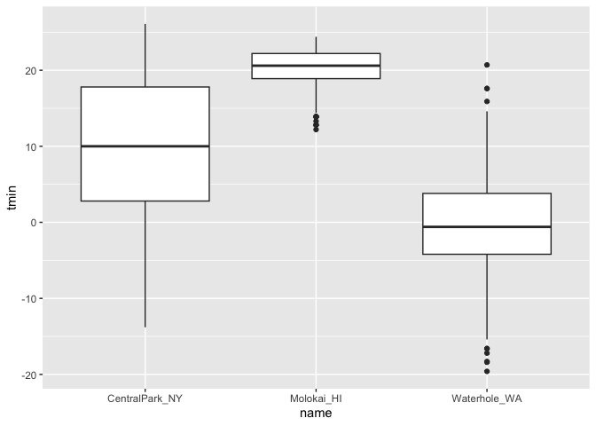<!-- -->

Trendy plots :-)

``` r
weather_df %>%
  ggplot(aes(x = name, y = tmin, fill = name)) +
  geom_violin(alpha = .5) +
  stat_summary(fun = "median")
```

    ## Warning: Removed 17 rows containing non-finite outside the scale range
    ## (`stat_ydensity()`).

    ## Warning: Removed 17 rows containing non-finite outside the scale range
    ## (`stat_summary()`).

    ## Warning: Removed 3 rows containing missing values or values outside the scale range
    ## (`geom_segment()`).

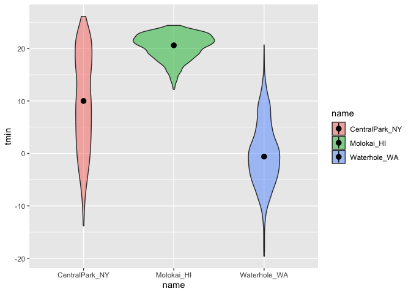<!-- -->

-geom_violin: violin plot, might be more informative (more distribution
shape) than box plot -stat_summary(fun = “median”): show the median

Ridge plots – the most popular plot of 2017

``` r
weather_df %>%
  ggplot(aes(x = tmin, y = name)) +
  geom_density_ridges()
```

    ## Picking joint bandwidth of 1.41

    ## Warning: Removed 17 rows containing non-finite outside the scale range
    ## (`stat_density_ridges()`).

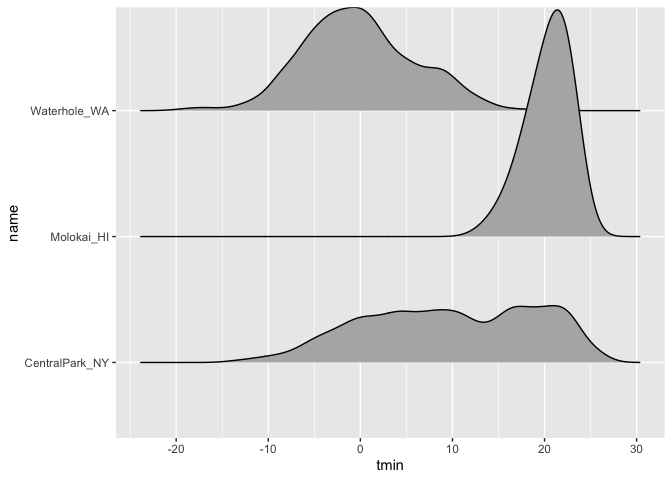<!-- -->
geom_density_ridges: Ridge plots are used to visualize the distribution
of a numeric variable for several groups. Each group’s distribution is
displayed as a density plot, and the plots are stacked vertically.
